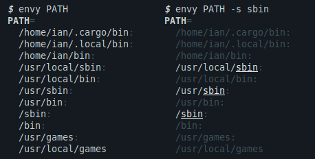

Envy
====
A command line tool for displaying environment variables in a human friendly form.

Variables may be selected by name, glob-like `pattern` or regular expression (`-r`).



Variable values are split by the OS specific path separator, and the parts can be further searched (`-s`).

## Usage
```
Formats and displays environment variables for human friendly reading,
searching and comparison

Usage: envy [OPTIONS] [pattern]

Arguments:
  [pattern]
          The name or glob-like pattern of the environment variable(s) to show
          (use -r to switch to regular expressions). If omitted, all
          environment variables will be displayed

Options:
  -r, --regex
          Treat pattern as a regular expression to match against names

  -s, --search <regex>
          Search the values of environment variables for the given pattern

  -i, --ignore-case
          Make regular expression search and pattern match case insensitive

      --color[=<when>]
          Control when to color the output

          [default: auto]
          [possible values: auto, always, never]

  -h, --help
          Print help (see a summary with '-h')

  -V, --version
          Print version

Environment:
  ENVY_COLORS
          Overrides the default colors used to display different elements of
          the output:
            <var>iable  - environment variable names
            <val>ue     - environment variable values
            <spe>cial   - special characters
            <sep>arator - separator characters

          Color settings are colon-separated, key-value pairs in key=value
          form. Values are ANSI color codes.

          [default: var=1:val=:mat=4;97:unm=90:spe=36:sep=90]

  ENVY_SEP
          Overrides the OS specific path separators, which by default are:
          Linux/MacOS:  ENVY_SEP=:,
          Windows:      ENVY_SEP=;,:
```
